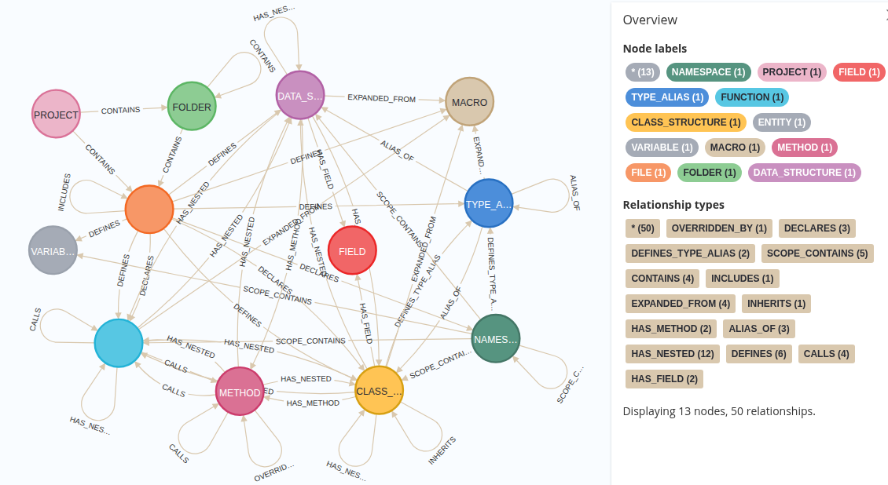

# Source Code Graph RAG (using Clang/Clangd)

This project builds a Neo4j graph RAG (Retrieval-Augmented Generation) for a C/C++ software project based on clang/clangd, which can be queried for deep software project analysis.

### Example Questions it Can Help With:

*   "What are the key modules in this project?"
*   "Show me the call chain for function X"
*   "What's the architecture of this service?"
*   "Help me understand the workflow of this feature"
*   "Identify potential race conditions when accessing this variable"

The project provides the graph RAG building and updating tools, along with an example MCP server and an AI expert agent. You can also develop your own MCP servers and agents around the graph RAG for your specific purposes, such as:

**Software Analysis**
*   Analyze project organization (folders, files, modules)
*   Analyze code patterns and structures
*   Understand call chains and class relationships
*   Examine architectural design and workflows
*   Trace dependencies and interactions

**Expert Assistance**
*   **Code Refactoring Advice**: Provide guidance on design improvements and optimizations
*   **Bug Analysis**: Help identify root causes of bugs or race conditions
*   **Documentation**: Assist with software design documentation
*   **Feature Implementation**: Guide on implementing features based on requirements
*   **Architecture Review**: Analyze and suggest improvements to system architecture

---

### Current Schema



## Table of Contents
- [Why This Project?](#why-this-project)
- [Key Features & Design Principles](#key-features--design-principles)
- [Prerequisites](#prerequisites)
- [Primary Usage](#primary-usage)
  - [Full Graph Build](#full-graph-build)
  - [Incremental Graph Update](#incremental-graph-update)
  - [Common Options](#common-options)
- [Interacting with the Graph: AI Agent](#interacting-with-the-graph-ai-agent)
- [Supporting Scripts](#supporting-scripts)
- [Documentation & Contributing](#documentation--contributing)

## Why This Project?

For C/C++ project, Clangd index YAML file is an intermediate data format from [Clangd-indexer](https://clangd.llvm.org/design/indexing.html) containing detailed syntactical information used by language servers for code navigation and completion. However, while powerful for IDEs, the raw index data doesn't expose the full graph structure of a codebase (especially the call graph) or integrate the semantic understanding that Large Language Models (LLMs) can leverage.

This project fills that gap. It ingests Clangd index data into a Neo4j graph database, reconstructing the complete file, symbol, and call graph hierarchy. It then enriches this structure with AI-generated summaries and vector embeddings, transforming the raw compiler index into a semantically rich knowledge graph. In essence, `clangd-graph-rag` extends Clangd's powerful foundation into an AI-ready code graph, enabling LLMs to reason about a codebase's structure and behavior for advanced tasks like in-depth code analysis, refactoring, and automated reviewing.

## Key Features & Design Principles

*   **AI-Enriched Code Graph**: Builds a comprehensive graph of files, folders, symbols, and function calls, then enriches it with AI-generated summaries and vector embeddings for semantic understanding.
*   **Robust Dependency Analysis**: Builds a complete `[:INCLUDES]` graph by parsing source files, enabling accurate impact analysis for header file changes.
*   **Compiler-Accurate Parsing**: Leverages `clang` via a `compile_commands.json` file to parse source code with full semantic context, correctly handling complex macros and include paths.
*   **Incremental Updates**: Includes a Git-aware updater script that efficiently processes only the files changed between commits, avoiding the need for a full rebuild.
*   **AI Agent Interaction**: Provides a tool server and an example agent to allow for interactive, natural language-based exploration and analysis of the code graph.
*   **Adaptive Call Graph Construction**: Intelligently adapts its strategy for building the call graph based on the version of the `clangd` index, using the `Container` field when available and falling back to a spatial analysis when not.
*   **High-Performance & Memory Efficient**: Designed for performance with multi-process and multi-threaded parallelism, efficient batching for database operations, and intelligent memory management to handle large codebases.
*   **Modular & Reusable**: The core logic is encapsulated in modular classes and helper scripts, promoting code reuse and maintainability.

## Prerequisites
### Input file dependencies
To successfully build the graph, this project leverages the power of the LLVM ecosystem. Before starting, ensure you have the following two components ready:

1. **JSON Compilation Database (.json)**
 
    The project requires a compile_commands.json file, which provides the necessary compiler flags and include paths for your source code. This file is usually generated by your build system. There are usually two ways:
   - If you are using CMake, you can use the following command:
     ```
     cmake -DCMAKE_EXPORT_COMPILE_COMMANDS=ON <your_original_cmake_option>
     ```
   - If you are using Make, you can use the following command: 
     ```
     bear -- make <your_original_make_option>
     ```
   For other build system like Bazel, please refer to [LLVM original document](https://clang.llvm.org/docs/JSONCompilationDatabase.html) for more details.

   By default, the system looks for the `compile_commands.json` files in the root of your project path. If they are located elsewhere, you can point to them using the `--compile-commands` option. For more details on customizing paths, see the [Common Options](#common-options) section.

2. **Clangd Index File (.yaml)**

   In addition to the compilation database, you will need a static index generated by clangd-indexer （version >= 21.0.0). (If you don't have it, you can download the indexing-tools directly from the official [clangd releases](https://github.com/clangd/clangd/releases), or you can build it from [llvm source](https://github.com/llvm/llvm-project).)

   Then you can use the following command to generate the index file:
   ```
   clangd-indexer --executor=all-TUs --format=yaml <path/to/compile_commands.json> > index.yaml
   ```
   The `<path/to/compile_commands.json>` can be `.` (a dot) if it is in the current directory.

   By default, the system does not assume the index file is in the root of your project path. You should specify its path explicitly in command line as the first argument. For more details, see the [Primary Usage](#primary-usage) section.

### Other installation dependencies
1. **clang**
 
   The project requires a clang installed on your system (that has libclang included). Your system usually has it by default. If not, you can download it from the official [clang website](https://clang.llvm.org/)， version >= 21.0.0.

2. **Neo4j**

   The project requires a Neo4j database to store the graph data. You can download it from the official [Neo4j website](https://neo4j.com/download/), version >= 5.0.0.

3. **Python**

   The project requires `Python 3.13` (or higher). Then you can install the required packages using the following command:
   ```
   pip install -r requirements.txt
   ```
   If you only want to build the graphRAG without the example AI agent (developed using Google ADK), `python 3.11` is enough.

## Primary Usage

The two main entry points for the pipeline are the builder and the updater.

**Note**: All scripts now rely on a `compile_commands.json` file for accurate source code analysis. The examples below assume this file is located in the root of your project path. If it is located elsewhere, you must specify its location with the `--compile-commands` option (see Common Options).

For all the scripts that can run standalone, you can always use --help to see the full CLI options.

### Full Graph Build

Used for the initial, from-scratch ingestion of a project. Orchestrated by `clangd_graph_rag_builder.py`.

```bash
# Basic build (graph structure only). You can generate LLM summary RAG data with a separate step later.
python3 clangd_graph_rag_builder.py /path/to/clangd-index.yaml /path/to/project/

# Build the graph with LLM summary RAG data generation (note: the default uses fake LLM unless you specify --llm-api)
python3 clangd_graph_rag_builder.py /path/to/clangd-index.yaml /path/to/project/ --generate-summary
```
Please check the detailed design document for more details: [Clangd Graph RAG Builder](./docs/summary_clangd_graph_rag_builder.md)

### Summary RAG Data Generation

After the graph is built, you can generate LLM summary RAG data with the following command:
```bash
python3 code_graph_rag_generator.py /path/to/clangd-index.yaml /path/to/project/
```
Please check the detailed design document for more details: [Code Graph RAG Data Generation](./docs/summary_code_graph_rag_generator.md)

### Incremental Graph Update

Used to efficiently update an existing graph with changes from Git. Orchestrated by `clangd_graph_rag_updater.py`.

```bash
# Update from the last known commit in the graph to the current HEAD
python3 clangd_graph_rag_updater.py /path/to/new/clangd-index.yaml /path/to/project/

# Update between two specific commits
python3 clangd_graph_rag_updater.py /path/to/new/clangd-index.yaml /path/to/project/ --old-commit <hash1> --new-commit <hash2>
```
Please check the detailed design document for more details: [Clangd Graph RAG Updater](./docs/summary_clangd_graph_rag_updater.md)

### Common Options

Both the builder and updater accept a wide range of common arguments, which are centralized in `input_params.py`. These include:

*   **Compilation Arguments**:
    *   `--compile-commands`: Path to the `compile_commands.json` file. This file is essential for the new accurate parsing engine. By default, the tool searches for `compile_commands.json` in the project's root directory.
*   **RAG Arguments**: Control summary and embedding generation (e.g., `--generate-summary`, `--llm-api`).
*   **Worker Arguments**: Configure parallelism (e.g., `--num-parse-workers`, `--num-remote-workers`).
*   **Batching Arguments**: Tune performance for database ingestion (e.g., `--ingest-batch-size`, `--cypher-tx-size`).
*   **Ingestion Strategy Arguments**: Choose different algorithms for relationship creation (e.g., `--defines-generation`).

Run any script with `--help` to see all available options.

## Interacting with the Graph: AI Agent

Once the code graph is built and enriched, you can interact with it using natural language through an AI agent. The project provides an example implementation of an MCP tool server and an agent built with the Google Agent Development Kit (ADK) to enable this.

1.  **`graph_mcp_server.py`**: This is a tool server that exposes the Neo4j graph to an AI agent. It provides example tools like `get_graph_schema`, `execute_cypher_query`, and `get_file_source_code_by_path`. They are bare minimum yet super powerful tools for AI agent to interact with the graph.
2.  **`rag_adk_agent/`**: This directory contains an example agent built with the Google Agent Development Kit (ADK). This agent is pre-configured to use the tools from the MCP server to answer questions about your codebase. It just scratches the surface of what is possible with the tools provided.

### Example Workflow

1.  **Start the Tool Server**: In one terminal, start the server. It will connect to Neo4j and wait for agent requests.
    ```bash
    python3 graph_mcp_server.py
    ```
    It starts the MCP server at `http://0.0.0.0:8800/mcp`.

2.  **Run the Agent**: In a second terminal, run the agent. 

    By default, the agent connects the MCP server at `http://127.0.0.1:8800/mcp`, and uses LLM model `deepseek/deepseek-chat` via LiteLlm package. You can change the LLM_MODEL by setting the `LLM_MODEL` variable in the `rag_adk_agent/agent.py` file. For whatever LLM model you use, you need setup its API key per request by LiteLlm package.

    The recommended way is to use the ADK web UI.
    ```bash
    # For a web UI interaction
    adk web
    ```
    Then point to the server URL in your browser (default is `http://127.0.0.1:8000`) and select the agent `rag_adk_agent`.
    
    Or you can run it in a command-line session.
    ```bash
    # For an interactive command-line session
    adk run rag_adk_agent
    ```
    You can now ask the agent questions.

For more details, see the documentation for Agentic Components section in [Design Documentation](./docs/README.md).

## Supporting Scripts

These scripts are the core components of the pipeline and can also be run standalone for debugging or partial processing.

*   **`clangd_symbol_nodes_builder.py`**:
    *   **Purpose**: Ingests the file/folder structure and symbol definitions.
    *   **Assumption**: Best run on a clean database.
    *   **Usage**: `python3 clangd_symbol_nodes_builder.py <index.yaml> <project_path/>`

*   **`clangd_call_graph_builder.py`**:
    *   **Purpose**: Ingests *only* the function call graph relationships.
    *   **Assumption**: Symbol nodes (such as `:FILE`, `:FUNCTION`) must already exist in the database.
    *   **Usage**: `python3 clangd_call_graph_builder.py <index.yaml> <project_path/> --ingest`

*   **`code_graph_rag_generator.py`**:
    *   **Purpose**: Runs the RAG enrichment process on an *existing* graph.
    *   **Assumption**: The structural graph (files, symbols, calls) must already be populated in the database.
    *   **Usage**: `python3 code_graph_rag_generator.py <index.yaml> <project_path/> --llm-api fake`
    Please check the detailed design document for more details: [Code Graph RAG Generator](./docs/summary_code_graph_rag_generator.md)

*   **`neo4j_manager.py`**:
    *   **Purpose**: A command-line utility for database maintenance.
    *   **Functionality**: Includes tools to `dump-schema` for inspection or `delete-property` to clean up data.
    *   **Usage**: `python3 neo4j_manager.py dump-schema`

## Documentation & Contributing

### Documentation

Detailed design documents for each component can be found at [docs/README.md](docs/README.md) under [docs/](docs/) folder. 
For a comprehensive overview of the project's architecture, design principles, and pipelines, please refer to [docs/Building_an_AI-Ready_Code_Graph_RAG_based_on_Clangd_index.md](docs/Building_an_AI-Ready_Code_Graph_RAG_based_on_Clangd_index.md).

### Contributing

Contributions are welcome! This includes bug reports, feature requests, and pull requests. Feel free to try `clangd-graph-rag` on your own `clangd`-indexed projects and share your feedback.

### Future Work

The support to C/C++ is basically done. For next steps, we can focus on:
- Support data-dependence relationships. 
- Support to merge multiple projects into one graph.
- Support macro definition node and expansion relationship. 

## License

This project is licensed under the Apache License 2.0.