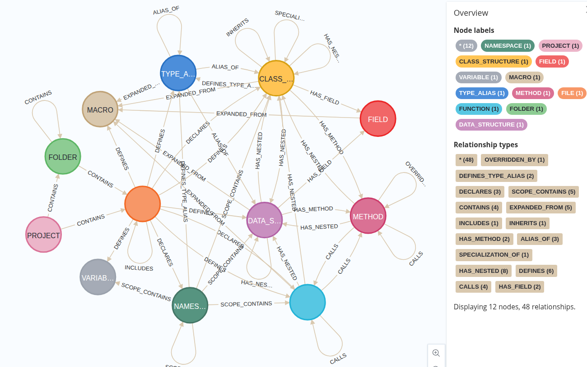

# Source Code Graph RAG (using Clang/Clangd)

This project builds a Neo4j graph RAG (Retrieval-Augmented Generation) for a C/C++ software project based on clang/clangd, which can be queried for deep software project analysis. It works well with large codebases like the Linux kernel, llvm, chromium, etc. 

The project includes an example MCP server and an AI expert agent. You can also develop your own MCP servers and agents around the graph RAG for your specific purposes, such as:

**Software Analysis**
*   Analyze project organization (folders, files, modules)
*   Analyze code patterns and structures
*   Understand call chains and class relationships
*   Examine architectural design and workflows
*   Trace dependencies and interactions

**Expert Assistance**
*   **Code Refactoring Advice**: Provide guidance on design improvements and optimizations
*   **Bug Analysis**: Help identify root causes of bugs or race conditions
*   **Documentation**: Assist with software design documentation
*   **Feature Implementation**: Guide on implementing features based on requirements
*   **Architecture Review**: Analyze and suggest improvements to system architecture

---

### Current Schema
Here is a simplified version of the [current neo4j schema](neo4j_simplified_schema.txt) for AI agent to use.



---
### A benchmark: The Linux Kernel

When building a code graph for the Linux kernel (WSL2 release) on a workstation (12 cores, 64GB RAM), it takes about ~4 hours using 10 parallel worker processes, with peak memory usage at ~32GB. Note this process does not include the LLM summary generation, so the total time (and cost) may vary based on your LLM provider. Local LLM API with Ollama is supported.

## Table of Contents
- [Why This Project?](#why-this-project)
- [Key Features & Design Principles](#key-features--design-principles)
- [Prerequisites](#prerequisites)
- [Primary Usage](#primary-usage)
  - [Full Graph Build](#full-graph-build)
  - [Incremental Graph Update](#incremental-graph-update)
  - [Common Options](#common-options)
- [Interacting with the Graph: MCP and Agent](#interacting-with-the-graph-ai-agent)
- [Supporting Scripts](#supporting-scripts)
- [Rebuild or Clean Up Graph](#rebuild-or-clean-up-graph)
- [Documentation & Contributing](#documentation--contributing)

## Why This Project?

For C/C++ project, Clangd language server has been very useful for developers using an IDE. The symbols in the code are represented in an intermediate data format from [Clangd-indexer](https://clangd.llvm.org/design/indexing.html) containing detailed syntactical information used by language servers for code navigation and completion. However, while powerful for IDEs, the raw index data doesn't expose the full graph structure of a codebase (e.g., the call graph, header dependence graph, macro expansion graph, etc.) or integrate the semantic understanding that Large Language Models (LLMs) can leverage.

This project fills that gap. It reconciles the Clangd index data and Clang parsing data, and ingests them into a Neo4j graph database, reconstructing the complete file, symbol, and relationship hierarchy. It then enriches this structure with AI-generated summaries and vector embeddings, transforming the raw compiler index into a semantically rich knowledge graph. In essence, `clangd-graph-rag` extends Clangd's powerful foundation into an AI-ready code graph, enabling LLMs to reason about a codebase's structure and behavior for advanced tasks like in-depth code analysis, refactoring, and automated reviewing.

Another powerful feature is that this project supports building the graphRAG incrementally, which means it can update the graph based on the diff of git commits without rebuilding the entire graph from scratch. This significantly reduces the time and cost of maintaining the graphRAG.

Note, this is an independent project and is not affiliated with the official Clang or clangd projects.

## Key Features & Design Principles

*   **AI-Enriched Code Graph**: Builds a comprehensive graph of files, folders, symbols, and function calls, then enriches it with AI-generated summaries and vector embeddings for semantic understanding.
*   **Robust Dependency Analysis**: Builds a complete `[:INCLUDES]` graph by parsing source files, enabling accurate impact analysis for header file changes.
*   **Compiler-Accurate Parsing**: Leverages `clang` via its compilation database (the `compile_commands.json` file) to parse source code with full semantic context, correctly handling complex macros and include paths.
*   **Incremental Updates**: Includes a Git-aware updater script that efficiently processes only the files changed between commits, avoiding the need for a full rebuild.
*   **AI Agent Interaction**: Provides a tool server and an example agent to allow for interactive, natural language-based exploration and analysis of the code graph.
*   **High-Performance & Memory Efficient**: Designed for performance with multi-process, multi-threaded, and asyncio coroutine parallelism, efficient batching for database operations, and intelligent memory management to handle large codebases.
*   **Modular & Reusable**: The core logic is encapsulated in modular classes and helper scripts, promoting code reuse and maintainability.

## Prerequisites
### Input file dependencies
To successfully build the graph, this project leverages the power of the LLVM ecosystem. Before starting, ensure you have the following two components ready:

1. **JSON Compilation Database (.json)**
 
    The project requires a compile_commands.json file, which provides the necessary compiler flags and include paths for your source code. This file is usually generated by your build system. There are usually two ways:
   - If you are using CMake, you can use the following command:
     ```
     cmake -DCMAKE_EXPORT_COMPILE_COMMANDS=ON <your_original_cmake_option>
     ```
   - If you are using Make, you can use the following command: 
     ```
     bear -- make <your_original_make_option>
     ```
   For other build system like Bazel, please refer to [LLVM original document](https://clang.llvm.org/docs/JSONCompilationDatabase.html) for more details.

   By default, the system looks for the `compile_commands.json` files in the root of your project path. If they are located elsewhere, you can point to them using the `--compile-commands` option. For more details on customizing paths, see the [Common Options](#common-options) section.

2. **Clangd Index File (.yaml)**

   In addition to the compilation database, you will need a static index generated by clangd-indexer （version >= 21.0.0). (If you don't have it, you can download the indexing-tools directly from the official [clangd releases](https://github.com/clangd/clangd/releases), or you can build it from [llvm source](https://github.com/llvm/llvm-project).)

   Then you can use the following command to generate the index file:
   ```
   clangd-indexer --executor=all-TUs --format=yaml <path/to/compile_commands.json> > index.yaml
   ```
   The `<path/to/compile_commands.json>` can be `.` (a dot) if it is in the current directory.

   By default, the system does not assume the index file is in the root of your project path. You should specify its path explicitly in command line as the first argument. For more details, see the [Primary Usage](#primary-usage) section.

### Other installation dependencies
1. **clang**
 
   The project requires a clang installed on your system (that has libclang included). Your system usually has it by default. If not, you can download it from the official [clang website](https://clang.llvm.org/)， version >= 21.0.0. (The project originally targeted clang version >= 16.x, but versions below 21.0.0 are not actively maintained.)

2. **Neo4j**

   The project requires a Neo4j database to store the graph data. You can download it from the official [Neo4j website](https://neo4j.com/download/), version >= 5.0.0. (I used to work with version 4.x. Not sure if it still works.)

3. **Python**

   The project requires `Python 3.13` (or higher). Then you can install the required packages using the following command:
   ```
   pip install -r requirements.txt
   ```
   If you only want to build the graphRAG without the example AI agent (which is developed using Google ADK), `python 3.11` is enough. You need remove the `google-adk` dependency from `requirements.txt`, and maintain your own requirements file.

## Primary Usage

The two main entry points for the pipeline are the builder and the updater.

**Note 1**: All scripts now rely on a `compile_commands.json` file for accurate source code analysis. The examples below assume this file is located in the root of your project path. If it is located elsewhere, you must specify its location with the `--compile-commands` option (see Common Options).

**Note 2**: It is highly recommended to create a `project-info.md` file in the project root folder as the project context information, which is extremely useful when you generate RAG summaries with LLM. The file content can be a few words or a few paragraphs as you want, such as "This LLVM project is a collection of modular compiler and toolchain technologies."

For all the scripts that can run standalone, you can always use --help to see the full CLI options.

### Full Graph Build

Used for the initial, from-scratch ingestion of a project. Orchestrated by `graph_builder.py`.

```bash
# Basic build (graph structure only, no LLM summary RAG data, which you can generate separately later)
python3 graph_builder.py /path/to/clangd-index.yaml /path/to/project/

# Build the graph with LLM summary RAG data generation (you don't need separate command for summary generation) 
python3 graph_builder.py /path/to/clangd-index.yaml /path/to/project/ --generate-summary [--llm-api [openai|deepseek|ollama|fake]]
```
* Without `--generate-summary`, the tool will only perform the graph construction phase. This is to give you an option to check the graph results before generating summaries that may cost time and money.
* With `--generate-summary` enabled, the tool will generate summary. By default it will use `--llm-api fake` to test the summary generation without actually calling an LLM API. You can use `--llm-api [openai|deepseek|ollama|fake]` to specify the LLM API to use. You need setup/config your API keys in the OS environment. Option `ollama` will use local ollama setup. I use LiteLLM to support multiple LLM APIs, so adding an API for your use case is super easy. Please check the `llm_client.py` for the details. 
* The generated summaries are cached in two levels of caches, so that you don't need to regenerate them if the source code of the project remains unchanged. If you did not specify the --llm-api in your previous runs (i.e., using the default `fake` llm client), and now you want to use a real LLM API, the fake summaries will be removed automatically, so that your graphRAG does not have mixed fake and real summaries. 

Please check the detailed design document for more details: [Graph Builder](./docs/graph_builder.md) or go to the [Documentation](#documentation) section for a full description.

### Summary RAG Data Generation

After the graph is fully built (without --generate-summary enabled), you can generate LLM summary RAG data with the following command. If you don't specify the --llm-api, it will use the `fake` llm client for testing purpose.
```bash
python3 -m summary_driver /path/to/clangd-index.yaml /path/to/project/ --llm-api [openai|deepseek|ollama|fake]
```
Please check the detailed design document for more details: [Summary Generation](./summary_driver/README.md) or go to the [Documentation](#documentation) section for a full description.

### Incremental Graph Update

Used to efficiently update an existing graph with changes from Git. Orchestrated by `graph_updater.py`.

```bash
# Update from the recorded last commit in the graph to the current HEAD 
python3 graph_updater.py /path/to/new/clangd-index.yaml /path/to/project/ --generate-summary --llm-api [openai|deepseek|ollama|fake]

# Update between two specific commits
python3 graph_updater.py /path/to/new/clangd-index.yaml /path/to/project/ --old-commit <hash1> --new-commit <hash2> --generate-summary --llm-api [openai|deepseek|ollama|fake]
```
Note: If your full build graphRAG has been generated with a real LLM API, you definitely want to use a real one for the incremental update as well, to avoid the `fake` llm client polluting your graphRAG with meaningless summaries. If you accidently used the `fake` llm client, and your graphRAG is polluted, no worry. Please check section [Rebuild or Clean Up Graph](#rebuild-or-clean-up-graph) on how to deal with it. 

Please check the detailed design document for more details: [Graph Updater](./docs/graph_updater.md) or go to the [Documentation](#documentation) section for a full description.

### Common Options

You can always use `--help` option to check all the available options for any script. Here is a list of commonly used options.

Both the builder, updater and other scripts accept a wide range of common arguments, which are centralized in `input_params.py`. These include:

*   **Compilation Arguments**:
    *   `--compile-commands`: Path to the `compile_commands.json` file. This file is essential for the new accurate parsing engine. By default, the tool searches for `compile_commands.json` in the project's root directory.
*   **RAG Arguments**: Control summary and embedding generation (e.g., `--generate-summary`, `--llm-api`).
*   **Worker Arguments**: Configure parallelism depends on your system resources
    *   `--num-parse-workers`: Number of parallel parsing worker processes for YAML index file and source file parsing, in case you have a large codebase with lots of files (like Linux kernel). This may need to be tuned based on your system resources. Usually set to a number close to the number of available CPU cores.
    *   `--num-remote-workers`: Number of remote worker threads for LLM API calls. This is for IO bound operation, can be set to a big number. May use coroutines in future, but threads works fine for now.
*   **Batching Arguments**: Tune performance for database ingestion (e.g., `--ingest-batch-size`, `--cypher-tx-size`).

## Interacting with the Graph: AI Agent

Once the code graph is built and enriched, you can interact with it using natural language through an AI agent. The project provides an example implementation of an MCP tool server and an agent built with the Google Agent Development Kit (ADK) to enable this.

1.  **`graph_mcp_server.py`**: This is a tool server that exposes the Neo4j graph to an AI agent. It provides example tools like `get_graph_schema`, `execute_cypher_query`, and `get_file_source_code_by_path`. They are bare minimum yet super powerful tools for AI agent to interact with the graph.
2.  **`rag_adk_agent/`**: This directory contains an example agent built with the Google Agent Development Kit (ADK). This agent is pre-configured to use the tools from the MCP server to answer questions about your codebase. It just scratches the surface of what is possible with the tools provided.

### Example Workflow

1.  **Start the Tool Server**: In one terminal, start the server. It will connect to Neo4j and wait for agent requests.
    ```bash
    python3 graph_mcp_server.py
    ```
    It starts the MCP server at `http://0.0.0.0:8800/mcp`.

2.  **Run the Agent**: In a second terminal, run the agent. 

    By default, the agent connects the MCP server at `http://127.0.0.1:8800/mcp`, and uses LLM model `deepseek/deepseek-chat` via LiteLlm package. You can change the LLM_MODEL by setting the `LLM_MODEL` variable in the `rag_adk_agent/agent.py` file. For whatever LLM model you use, you need setup its API key per request by LiteLlm package.

    The recommended way is to use the ADK web UI.
    ```bash
    # For a web UI interaction
    adk web
    ```
    Then point to the server URL in your browser (default is `http://127.0.0.1:8000`) and select the agent `rag_adk_agent`.
    
    Or you can run it in a command-line session.
    ```bash
    # For an interactive command-line session
    adk run rag_adk_agent
    ```
    You can now ask the agent questions.

For more details, see the documentation for Agentic Components section in [Design Documentation](./docs/README.md#integration-and-agents).

## Supporting Scripts

These scripts are the core components of the pipeline and can also be run standalone for debugging or partial processing.

*   **`python3 -m source_parser`**:
    *   **Purpose**: Parses source code to extract function spans and include relations. Useful for AST inspection and header impact analysis.
    *   **Usage**: `python3 -m source_parser /path/to/source/`

*   **`python3 -m summary_driver`**:
    *   **Purpose**: Runs the RAG enrichment process on an *existing* graph.
    *   **Assumption**: The structural graph (files, symbols, calls) must already be populated in the database.
    *   **Usage**: `python3 -m summary_driver <index.yaml> <project_path/> --llm-api [openai|deepseek|ollama|fake]`

*   **`python3 -m summary_engine`**:
    *   **Purpose**: Manages the RAG summary cache (backup and restore).
    *   **Usage**: `python3 -m summary_engine backup`

*   **`python3 -m neo4j_manager`**:
    *   **Purpose**: A command-line utility for database maintenance.
    *   **Functionality**: Includes tools to `dump-schema` for inspection or `delete-property` to clean up data.
    *   **Usage**: `python3 -m neo4j_manager dump-schema`

*   **`graph_ingester/symbol.py`**:
    *   **Purpose**: Ingests the file/folder structure and symbol definitions, mainly for debugging.
    *   **Assumption**: Best run on a clean database.
    *   **Usage**: `python3 -m graph_ingester symbol <index.yaml> <project_path/>`

*   **`graph_ingester/call.py`**:
    *   **Purpose**: Dumps or ingests *only* the function call graph relationships, mainly for debugging.
    *   **Assumption**: Symbol nodes (such as `:FILE`, `:FUNCTION`) must already exist in the database.
    *   **Usage**: `python3 -m graph_ingester call <index.yaml> <project_path/> --ingest`


## Rebuild or Clean Up Graph

In this section, I will show you how to rebuild or clean up the graph.

### Rebuild the graphRAG

You can rebuild your graph with `--generate-summary --llm-api <real-api-name>`. Graph rebuilding may be acceptable sometimes, depending on your situation. 

1. **Rebuilding time**: If you had a full build with your project before, and the source code has no change since then, the rebuilding of its graphRAG can be quite fast, because the previous run already caches the results of the long time operations, i.e., the source tree parsing and the yaml index parsing. It may take only several minutes to rebuild the graph with the cached results. The real time consuming part (and also money consuming) is the summary generation process with a real LLM API. 

2. **Summarization time/cost**: If you had used real LLM API to generate some summaries, the results are not lost in graphRAG rebuilding. They are cached by the `llm-cache` separately in the disk, managed by `llm_client.py`. So rebuilding does not increase your time or cost for summarization.

3. **Other considerations**: The way Clangd-indexer works may introduce some inconsistance in your graph after many times of incremental update. E.g., your project source code may have two classes of same name, while clangd-indexer will choose one "winner" to represent the class (since they have the same USR: "Unified Symbol Resolution"), but merge the other class's relationships to the "winner". Different incremental updates may choose different "winner". This is not a bug of clangd-indexer or clangd-graph-rag, but an issue in your project source code. A graph rebuilding does not solve the issue of your project source code, but it helps to keep the graph consistent with the same "winner".

#### What if the database is huge when rebuilding

Rebuilding the graph will delete existing nodes/relationships. If your graph is really big (millions of nodes/relationships like Linux kernel), it may take some time to reset the database. It is recommended to reset your database through Neo4j commands before you start the rebuilding. Please check Neo4j manual or Google a solution on how to reset it. 

What I do is to delete the database files directly with the following commands. Don't use them unless you really know what you are doing. You need first check your Neo4j conf file (mine is /etc/neo4j/neo4j.conf) for its data path.

```
sudo systemctl stop neo4j 
sudo rm -fr <your_neo4j_data_path>/databases/neo4j/*
sudo rm -fr <your_neo4j_data_path>/transactions/neo4j/*
sudo systemctl start neo4j 
```

### Regenerate the summaries

If you don't want to rebuild your graph, you can simply regenerate the summaries, by following section [Summary Data Generation](#summary-rag-data-generation). We have two-level summary caching mechanism built-in, which can help you avoid regenerating summaries for unchanged code, thus saving your LLM credits. 

#### Just in case you are interested

1. **Node cache**: This is the Level-1 summary cache. When you generate summaries, the `summary_engine` will cache all the summaries in `<project_path>/.cache/summary_backup.json`. This cache is indexed by node ID (or file path for `FILE|FOLDER` nodes). It saves the `code_hash` of the node if the node is a function/method. When checking the cache validity, it compares the latest source code's hash value with the `code_hash` saved in the cache. If the function source code is modified, the cache will be invalidated and the cache has a miss. But if you only changed the prompt, the cache is still valid.

    Before calling the LLM to generate a summary, it will first check if the node cache has a valid summary for this node, and if so, it will return the cached summary. Please check the `summary_engine/node_cache.py` for more details. 

    Node cache caches summaries returned by the llm client, no matter which client it is, real or fake. So if you have used both real and fake clients to generate summaries, the node cache will contain both fake and real summaries. If you don't want to use the fake summaries, you can simply delete the entire cache file (see **LLM cache** below for why this is fine); or if you like, you can just remove the fake summaries in a surgical way.  

    For more details, please check the documentation for [Summary Engine](./summary_engine/README.md).

2. **LLM cache**: This is the Level-2 summary cache. When the summarizer has a cache miss in the Level-1 cache, it will issue an LLM request. The LLM client caches all the responses from real LLMs in `llm cache`, bypassing the responses from the fake client. The cache is indexed by the hash value of prompts. If the same prompt is issued again, the cached response will be returned. If your project source code has no change, but you changed the prompt, the `llm cache` will become invalid.

    This design ensures the `llm cache` has only real summaries. That means, all your real summaries won't be lost, even if you delete the Level-1 cache file at `<project_path>/.cache/summary_backup.json`. Of course you can also delete this Level-2 llm cache at `<project_path>/.cache/llm_cache/` if you want to start fresh. For example, you want to use a different LLM model, but usually you don't need to do that. 

    The llm cache is built with `diskcache (fanout)`, which is based on `sqlite`. The `fanout` configuration improves the concurrency performance. You can access its contents with sqlite tools like `sqlitebrowser` to view and edit the contents.

    For more details, please check the documentation for [LLM Client](./docs/llm_client.md).

3. **Why two levels of caches** As mentioned above, the node cache is valid as long as the source code is not modified, while the llm cache is valid only if the whole prompt matches. The node cache has both fake and real summaries, and the llm cache has only the real summaries. They can be used for different purposes. The node cache can be used to develop out-of-graph RAG systems; the llm cache can be shared by different projects if they point to the same cache folder.

### Clean up fake summaries

If your graph has mixed summaries of fake and real LLM API, you don't really need to do anything, because the system will clean them up automatically whenever you generate summaries with real LLM API. The system uses the following command to clean up the fake summaries automatically for you. You can also execute it manually.

```bash
python3 -m summary_engine clean-fakes
```

This will surgically remove fake content from both the Neo4j graph database and the summary cache, leaving you a clean graph and cache that have only real summaries.

#### What it really does

Here is what it really does:

1. **Delete the fake summary property from Neo4j**:
    ```bash
    python3 -m neo4j_manager delete-property --key fake_summary --all-labels --rebuild-indices
    ```

2. **Delete the fake summaries in the L1 summary cache (node cache)**:
    Fake summary can be cached in the file at `<project_path>/.cache/summary_cache.json`. You can manually delete the fake summaries from this file.
    ```bash
    python3 -m summary_engine clean-fake-cache
    ```
    You don't need to clean up the L2 summary cache (llm cache), because it only caches real LLM responses.

## Documentation & Contributing

### Documentation

Detailed design documents for each component can be found at [docs/README.md](docs/README.md) under [docs/](docs/) folder. 
For a comprehensive overview of the project's architecture, design principles, and pipelines, please refer to [docs/Building_an_AI-Ready_Code_Graph_RAG_based_on_Clangd_index.md](docs/Building_an_AI-Ready_Code_Graph_RAG_based_on_Clangd_index.md).

### Contributing

Contributions are welcome! This includes bug reports, feature requests, and pull requests. Feel free to try `clangd-graph-rag` on your own `clang` built projects and share your feedback.

### Future Work

The support to C/C++ is basically done. For next steps, we can focus on:
- Support data-dependence relationships. (What?!)
- Support to merge multiple projects into one graph.

## License

This project is licensed under the Apache License 2.0.
